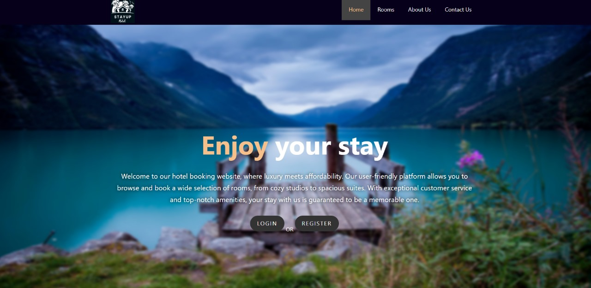
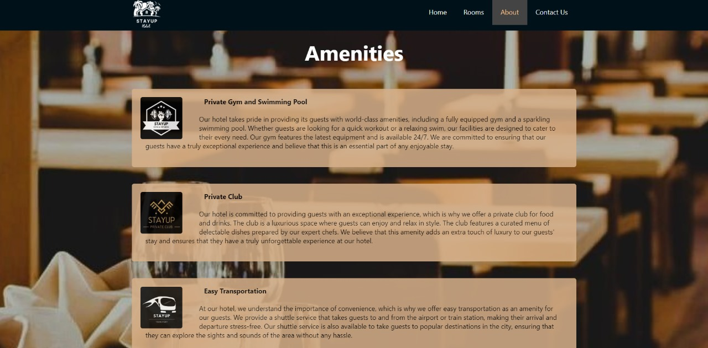
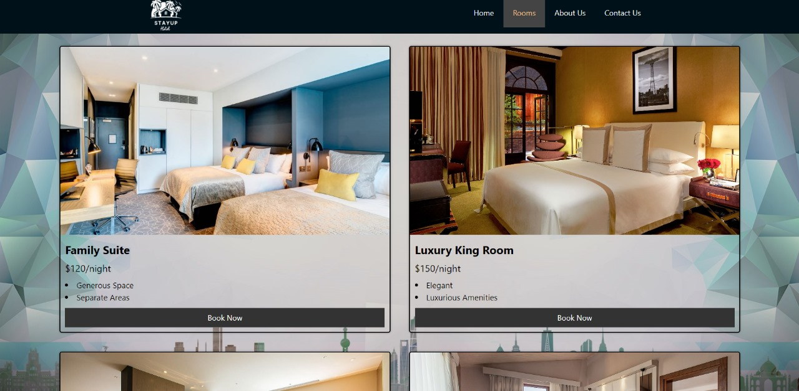
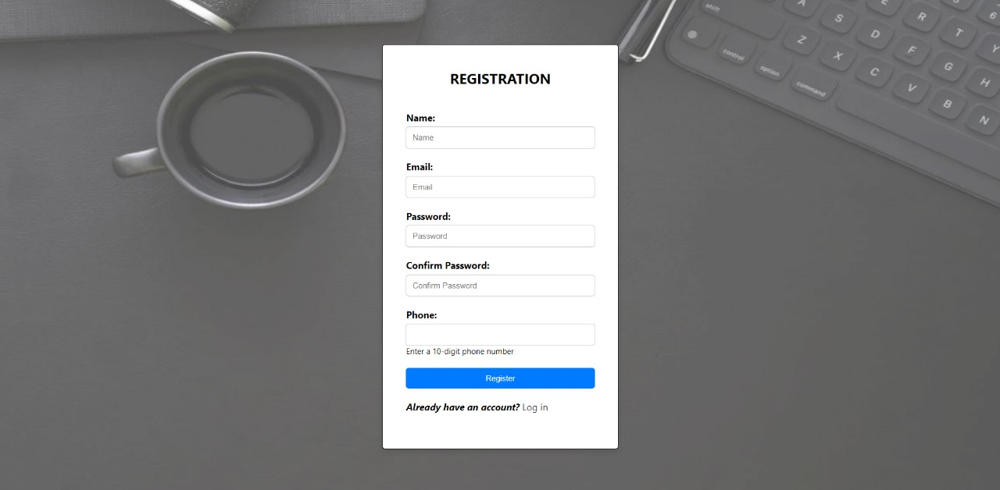
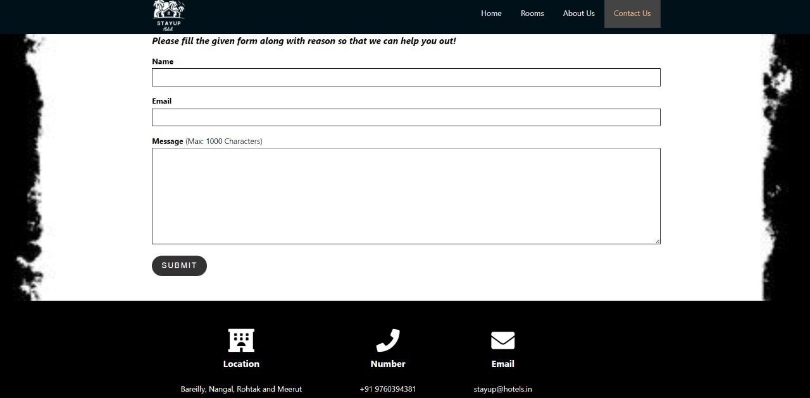

# Stay Up

A simple Hotel booking website with Backend Functionality


## Authors

- [@akshat](https://www.github.com/akshatg02/)

## Deployment

To deploy this project run

```bash
  node .\server.js
```


## Demo

[@StayUp](https://stayup.onrender.com)
## Environment Variables

To run this project, you will need to add the following environment variables to your .env file

`DB_USER`

`DB_HOST`

`DB_DATABASE`

`DB_PASSWORD`

`DB_PORT`

`PORT`

`SESSION_SECRET`
## Features

- Login/Signup
- Autofill login credentials
- Backend Validations
- SQL Database
- 'Rooms' Page with Authentication
- Working Contact-Us Page
- Password Encryption

## 🚀 About Me
I'm a Full stack Developer.

## 🔗 Links
[](https://www.linkedin.com/in/akshat-garg-9021a8225/)


## 🛠 Skills
HTML, CSS, JavaScript, ReactJs, MongoDB, MySQL, NodeJs, ExpressJs, EJS, etc.


## Tech Stack

**Client:** HTML, CSS, JavaScript

**Server:** NodeJs, ExpressJs

**Database:** SQL


## Roadmap

- Admin Panel
- Add to Cart
- Some more integrations


## Screenshots






